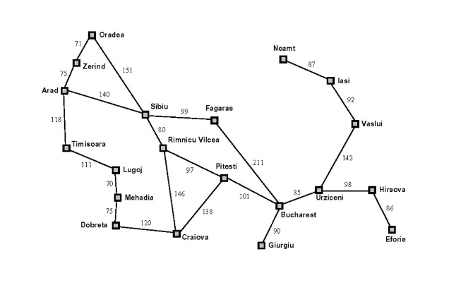

# Search_Code

Código en python para implementar diferentes tipos de métodos de busqueda.

Ramificación y acotación: En el archivo utils.py podemos encontrar la clase PriorityQueue, en ella, lo importante es tener en cuenta el método extend. Cada vez que se le llama, inserta un nuevo nodo en la lista y ésta se reordena siguiendo el criterio de menor path_cost.

Ramificación y acotación con subestimación: En el archivo utils.py podemos encontrar la clase PriorityHeurQueue, en ella, lo importante es tener en cuenta el método extend. Cada vez que se le llama, inserta un nuevo nodo en la lista y ésta se reordena siguiendo el criterio de menor path_cost + heurtística.

A continuación muestro un listado comparativo de nodos visitados en ambos métodos de búsqueda.

<table>
  <th>Ruta
  <th>Ramificación y acotación
  <th>Ramificación y acotación con subestimación
  <tr>
    <td>OE
    <td>40
    <td>15
  <tr>
    <td>AB
    <td>24
    <td>6
  <tr>
    <td>AC
    <td>20
    <td>7
  <tr>
    <td>TN
    <td>45
    <td>40
      
      
 Aquí dejo la imagen correspondiente a las rutas
 
 

